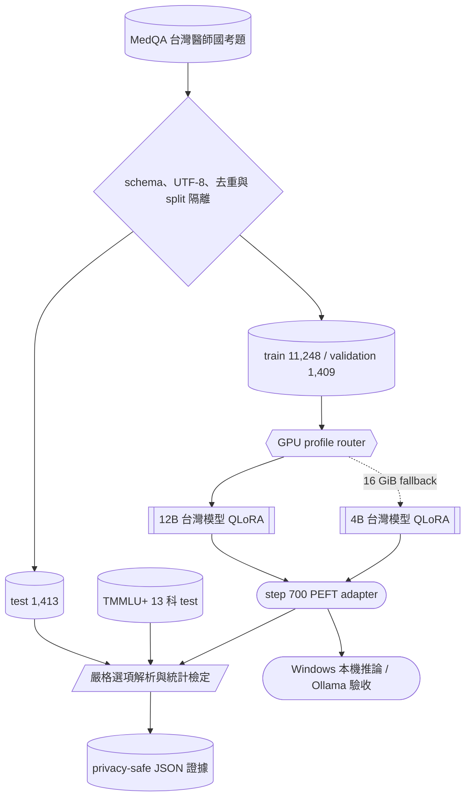

# tw-med-llm-qlora

<div align="center">

**可重現的台灣醫療選擇題 QLoRA 研究**

[](https://github.com/kuotunyu/tw-med-llm-qlora/actions/workflows/ci.yml)
[](https://github.com/kuotunyu/tw-med-llm-qlora/releases/latest)
[](https://www.python.org/)
[](LICENSE)
[](https://huggingface.co/steven0226/tw-med-llm-qlora-adapter)

**MedQA 72.05% · TMMLU+ 61.53% · 28,758 次正式生成 · public gated adapter**

</div>

> 僅供研究與教育用途，不構成醫療建議、診斷或治療依據。

## 關鍵成果

| 評估集 | 原始 instruct | 台灣 base | step 700 adapter | 相對台灣 base |
| --- | ---: | ---: | ---: | ---: |
| MedQA test（1,413 題） | 66.17% | 56.40% | **72.05%** | **+15.64 pp** |
| TMMLU+ 13 科（5,573 題） | 53.47% | 46.80% | **61.53%** | **+14.73 pp** |
| TMMLU+ 醫學 8 科 macro | 52.69% | 45.57% | **60.73%** | **+15.16 pp** |
| TMMLU+ 控制 5 科 macro | 51.73% | 44.91% | **58.41%** | **+13.50 pp** |

- MedQA adapter 對 base：bootstrap 95% CI **[13.38, 17.98] pp**，McNemar **p = 6.11 × 10⁻⁴⁰**。
- 五個非醫學控制科皆通過預先定義的 **−2 pp non-inferiority** 判準。
- adapter 在兩套正式評估的答案解析率皆為 **100%**。

## 研究架構



## 模型選型

| 角色 | 台灣模型 | 同尺寸原始基準 | 用途 |
| --- | --- | --- | --- |
| 正式路線 | `taide/Gemma-3-TAIDE-12b-Chat-2602` | `google/gemma-3-12b-it` | QLoRA 與正式比較 |
| 16 GiB fallback | `twinkle-ai/gemma-3-4B-T1-it` | `google/gemma-3-4b-it` | 低 VRAM smoke test |

正式設定：4-bit NF4、rank/alpha `16/16`、learning rate `5e-5`、max sequence length `2048`、effective batch `16`、seed `3407`、1 epoch。最終採用 step 700；step 703 因 post-train validation 出現 NaN 而拒絕。

## 快速開始

需求：Windows 11 或 Linux、Python 3.11、[uv](https://docs.astral.sh/uv/)。

```powershell
git clone https://github.com/kuotunyu/tw-med-llm-qlora.git
cd tw-med-llm-qlora
Copy-Item .env.example .env
uv sync --locked
uv run pytest -q
uv run ruff check .
```

準備資料：

```powershell
uv sync --group data --locked
uv run --group data python -m tw_med_qlora.cli.validate_medqa_sample
uv run --group data python -m tw_med_qlora.cli.prepare_medqa
```

Windows 本機推論：

```powershell
uv sync --group inference --locked
uv run tw-med-local-infer `
  --adapter steven0226/tw-med-llm-qlora-adapter `
  --prompt "請選出最適合的答案：..."
```

adapter 為 public + automatic gated；首次使用前須在[模型頁](https://huggingface.co/steven0226/tw-med-llm-qlora-adapter)同意條款並完成 Hugging Face 驗證。

## 評估結果

正式評估固定模型、資料與生成設定，共完成 **28,758 次生成**。MedQA 使用精確選項解析；TMMLU+ 同時評估八個醫學科目與五個非醫學控制科，避免只看醫療分數而忽略一般能力退化。

| 模型 | MedQA accuracy / parse | TMMLU+ accuracy / parse |
| --- | ---: | ---: |
| 原始 instruct | 66.17% / 99.93% | 53.47% / 99.89% |
| 台灣 base | 56.40% / 79.26% | 46.80% / 80.75% |
| **step 700 adapter** | **72.05% / 100%** | **61.53% / 100%** |

完整聚合結果與統計檢定見 [`phase4-results.json`](reports/phase4/full/public/phase4-results.json)；公開報告不含題目全文、raw model output、token、私密路徑或模型權重。

## 可重現性

- MedQA：`bigbio/med_qa`（[revision `e04abdc`](https://huggingface.co/datasets/bigbio/med_qa/tree/e04abdc0672c54547fa1dbe36cfefc000e4f2657)）；test split 從未進入 trainer。
- TMMLU+：`ikala/tmmluplus`（[revision `81d53e3`](https://huggingface.co/datasets/ikala/tmmluplus/tree/81d53e38340c9ade988f7fed8996da6554b504f3)）；僅用於正式評估。
- base model：`taide/Gemma-3-TAIDE-12b-Chat-2602`（[revision `4de0b93`](https://huggingface.co/taide/Gemma-3-TAIDE-12b-Chat-2602/tree/4de0b93b99f8b61b59c40d019fd593bdd1c42249)）。
- GitHub Actions 在 Windows 與 Linux 驗證測試、Ruff、lockfile、notebook freshness、package allowlist 與乾淨安裝。
- v0.2.0 的 wheel、sdist 與 release notes 位於 [GitHub Release](https://github.com/kuotunyu/tw-med-llm-qlora/releases/tag/v0.2.0)。

核心證據：

- [資料驗證](reports/data_validation.json)
- [正式訓練 manifest](reports/phase3/full/20260722T014216Z-run-manifest.json)
- [正式評估](reports/phase4/full/public/phase4-results.json)
- [Windows 本機推論驗收](reports/phase5/20260722T131736Z-acceptance.json)
- [public gated 發布驗證](reports/phase7/20260723T164059Z-public-validation.json)
- [v0.2.0 package audit](reports/phase8/v0.2.0-package-audit.json)

## 訓練曲線與成本

| 工作 | 硬體 | 實際用量 |
| --- | --- | ---: |
| Phase 3 正式 QLoRA | A100 40GB | 1.143 小時 / **6.06 CU** |
| Phase 4 正式評估 | A100 40GB | 2.542 小時 / **13.47 CU** |
| 選配 GGUF Q4_K_M 匯出 | A100 40GB | 核准上限 **6.36 CU** |


CU 單價會依方案變動，因此公開報告保留可核對的計算單位，不換算特定幣別。GGUF 僅保存於私人雲端硬碟；文字與 VLM 雙 GGUF 已通過 Windows Ollama 實機驗收，未對外發布大型權重。

## 發布狀態

- GitHub：[`v0.2.0`](https://github.com/kuotunyu/tw-med-llm-qlora/releases/tag/v0.2.0)，含通過 allowlist 與乾淨安裝驗收的 wheel / sdist。
- Hugging Face：[`steven0226/tw-med-llm-qlora-adapter`](https://huggingface.co/steven0226/tw-med-llm-qlora-adapter)，public + automatic gated。
- adapter revision：[`b1d8f74`](https://huggingface.co/steven0226/tw-med-llm-qlora-adapter/tree/b1d8f74291da75d0719b5a3ea0d088ee8236e096)。
- 最小發布集合：`adapter_config.json`、`adapter_model.safetensors`、模型卡與授權 PDF；遠端逐檔 SHA-256 已驗證。
- Windows 本機推論與 Ollama 驗收證據均已歸檔。

## 資料來源與授權

- 訓練與 MedQA 評估：[`bigbio/med_qa`](https://huggingface.co/datasets/bigbio/med_qa)，固定 revision；本專案不重新散布題目全文。
- 遷移與能力保留評估：[`ikala/tmmluplus`](https://huggingface.co/datasets/ikala/tmmluplus)，固定 revision；僅保存聚合結果與必要證據。
- 程式碼採 MIT License；adapter 另受 base model 的 TAIDE Gemma 授權與 gated 使用條款約束，詳見[模型卡](model_card/README.md)與[授權 PDF](model_card/TAIDE-GEMMA-LICENSE.pdf)。

## 限制

- 這是選擇題研究，不代表臨床決策能力。
- adapter 的提升同時受題型、提示格式與答案解析規則影響。
- 結果只對固定 revision、資料切分與軟體環境成立。
- 沒有進行新訓練來驗證跨資料集、長文本或真實醫療情境。

## 引用

GitHub 可依 [`CITATION.cff`](CITATION.cff) 產生 APA 與 BibTeX；版本變更見 [`CHANGELOG.md`](CHANGELOG.md)。引用實驗結果時，請同時標註 release tag、模型 revision 與對應報告。

## 授權

程式碼採 [MIT License](LICENSE)。模型、adapter 與資料仍受各自上游授權與使用條款約束。
