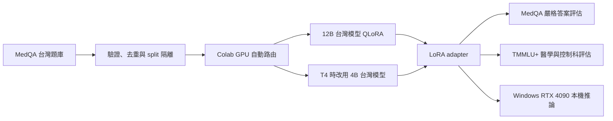
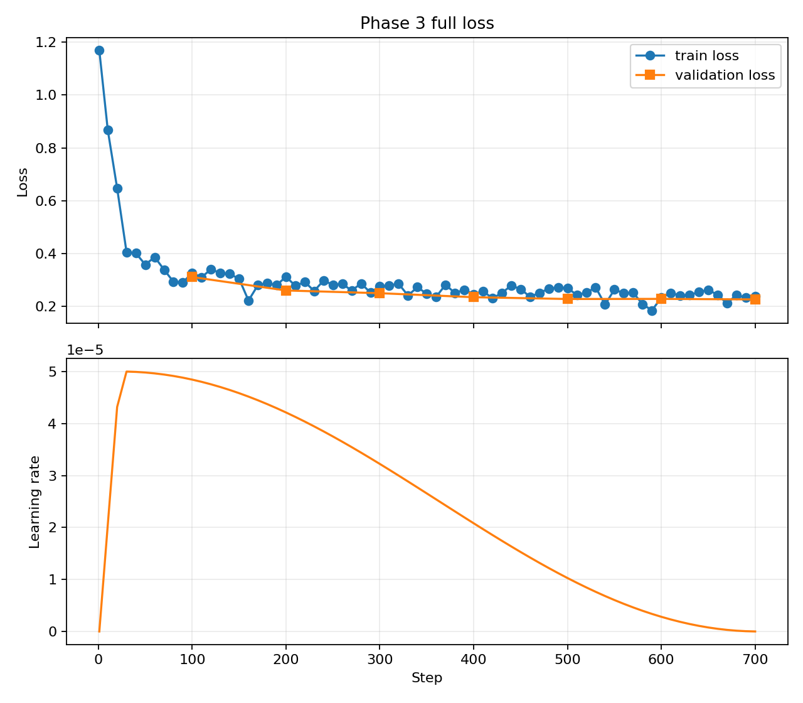

# tw-med-llm-qlora

> 本專案僅供模型研究與教育用途，不構成醫療建議、診斷或治療依據。

## 個人動機

我一直對台灣開源模型生態很有興趣，也想知道在地化模型進入醫療這類高門檻領域後，透過有限算力與可重現的參數高效微調，究竟能走多遠。這個專案不追求包裝成醫療產品，而是把資料品質、訓練成本、能力增益與能力退化都攤開來量測，留下其他人能重跑、能質疑、也能改進的研究紀錄。

## 目前狀態

Phase 0–4 已完成。TAIDE 12B 的 A100 40GB、11,248 筆、1 epoch QLoRA 已跑完，正式 adapter 選用完成 1,409 筆 validation 的 step 700。Phase 4 已完成 28,758 次正式生成與本機證據驗證：adapter 在 MedQA test 達 72.05%，在 13 科 TMMLU+ 達 61.53%，且五個非醫學控制科通過預先定義的 −2 個百分點 non-inferiority 判準。Phase 5 的 Windows RTX 4090 base + adapter acceptance 與 GitHub hosted Windows／Linux CPU CI 均已通過；目前只剩 Hugging Face 私人目標確認、adapter 發布與 receipt 驗證，權重尚未公開。

## 研究架構



## 模型選型

| 執行條件 | 台灣模型 | 同尺寸原廠基準 | 吞吐設定 |
| --- | --- | --- | --- |
| BF16 且 VRAM ≥ 70 GiB | `taide/Gemma-3-TAIDE-12b-Chat-2602` | `google/gemma-3-12b-it` | batch 8 / grad 2 |
| BF16 且 VRAM ≥ 38 GiB | `taide/Gemma-3-TAIDE-12b-Chat-2602` | `google/gemma-3-12b-it` | batch 4 / grad 4 |
| BF16 且 VRAM ≥ 22 GiB | `taide/Gemma-3-TAIDE-12b-Chat-2602` | `google/gemma-3-12b-it` | batch 1 / grad 16 |
| T4／約 16 GiB | `twinkle-ai/gemma-3-4B-T1-it` | `google/gemma-3-4b-it` | batch 2 / grad 8 fallback |

選擇台灣模型的目的，是測量語言與文化在地化之後，再加入專業領域微調所能帶來的額外效果；同尺寸原廠 instruct 僅作研究基準。模型 ID 與授權以各自模型卡為準。

## 開發階段

| Phase | 內容 | 狀態 |
| --- | --- | --- |
| 0 | 骨架、規格、skill、uv、測試 | 完成 |
| 1 | MedQA 驗證與可重現處理 | 完成 |
| 2 | 100 筆、10 steps smoke test | 完成 |
| 3 | 完整 QLoRA 與 checkpoint | 完成；證據驗證通過 |
| 4 | MedQA + TMMLU+ 雙軌評估 | 完成；28,758 requests 與證據驗證通過 |
| 5 | RTX 4090 推論與發布 | 進行中；4090 acceptance 與 hosted CI 通過，等待 HF 目標與 receipt |

每個 Phase 都必須先展示測試與產物，經確認後才進入下一階段。完整決策與執行紀錄見 [PROJECT_PLAN.md](PROJECT_PLAN.md)。

Repository 內含最小權限、無 secrets 的 CPU CI；每次 push／pull request 會在 Windows 與 Linux 的 Python 3.11 環境，以 `uv.lock` 執行 Ruff、完整 pytest 及四份 notebook freshness 檢查。公開 root commit `180e544` 的 [GitHub Actions CI #1](https://github.com/kuotunyu/tw-med-llm-qlora/actions/runs/29937271766) 已由 `windows-latest` 與 `ubuntu-latest` 實測通過。GPU smoke、完整訓練、正式評估與 4090 acceptance 不會在 CI 中誤觸。

## 快速開始

需求：Windows 11 或 Linux、Python 3.11、[uv](https://docs.astral.sh/uv/)。一般品質檢查可在 CPU 執行；12B 本機推論另須通過下方固定的 RTX 4090 硬體閘門。

```powershell
Copy-Item .env.example .env
uv sync
uv run pytest
uv run ruff check .
```

請自行把 token 寫入 `.env` 或 Colab Secrets；不要提交 `.env`。QLoRA 訓練直接使用 Unsloth、Transformers、PEFT 與 TRL 的官方原生 API；本專案不是 Agent/RAG 應用，因此不引入 LangChain。

Phase 1 目前鎖定的關鍵套件版本為：`huggingface-hub 1.24.0`、`pyarrow 25.0.0`、`python-dotenv 1.2.2`、`transformers 5.14.1`。五筆 gate 可重跑：

```powershell
uv run --group data python -m tw_med_qlora.cli.validate_medqa_sample
uv run --group data python -m tw_med_qlora.cli.prepare_medqa
```

公開的[五筆驗證報告](reports/data_sample_validation.json)與[全量品質報告](reports/data_validation.json)只包含 schema、筆數、版本與不可逆 hash，不包含題目正文。

### Phase 1 資料結果

| Split | 原始筆數 | 品質排除 | 重複排除 | 處理後筆數 |
| --- | ---: | ---: | ---: | ---: |
| train | 11,298 | 8 | 42 | 11,248 |
| validation | 1,412 | 1 | 2 | 1,409 |
| test | 1,413 | 0 | 0 | 1,413 |

重複鍵採題幹收斂空白後的 case-insensitive 比較，不做 Unicode NFKC 相容字元折疊，以免過度合併醫學符號。train/validation 共排除 3 筆缺值、6 筆選項文字重複題；test 保持 1,413 筆原始順序與內容，且不被訓練流程引用。相同命令連跑兩次後，report 與三個 split 的 SHA-256 均一致。

### Phase 2：Colab smoke test

[訓練 notebook](notebooks/train_qlora.ipynb)已建立，僅允許 100 筆、10 steps；不含完整訓練與 Hub 發布。使用方式：

1. 在全新 Colab runtime 開啟 notebook，將 runtime type 設為 GPU；若介面允許選 premium GPU，優先選 A100/H100，其次 L4。直接從最上方按「全部執行」，不要從模型載入格開始。
2. 在左側 Secrets 新增 `HF_TOKEN` 並允許 notebook 存取；若要選配線上追蹤，再加入 `WANDB_API_KEY`。
3. 如需金額估算，在固定設定格填入自己帳務頁當下的 `COMPUTE_UNITS_PER_HOUR` 與 `PRICE_PER_COMPUTE_UNIT`；留空時只估時數。
4. 安裝格後會立即檢查 Unsloth 與關鍵套件的 module 和鎖定版本；gate 通過後不要重新啟動 runtime。接著模型會完整下載固定 revision，驗證 safetensors index、所有 shard、tokenizer 與必要的 processor 檔，再把同一個本機 snapshot 明確交給 Unsloth；若下載中斷可重跑同一格續用 cache。保存後的重載驗證也會先從此 pinned snapshot 建立 base，再以 PEFT 掛載 adapter，同時保留 adapter 內正式的 Hub base ID。GPU 不符合、權重缺檔、資料 hash 改變、loss 非有限值、adapter 不相容或輸出無法嚴格解析成 A–D 時，流程會停止。
5. 完成後保留 Drive 中的 zip，並回傳同一資料夾內的小型 run manifest、receipt 和最後輸出確認；不得自行把 `ALLOW_FULL_TRAINING` 改為 true。

GPU 路由會在載入模型前完成：80GB premium 使用 batch 8 / grad 2，40GB premium 使用 batch 4 / grad 4，L4 24GB 使用 batch 1 / grad 16；三者都跑同一個 12B 模型並維持 effective batch 16。約 16GB、無 BF16 的 T4 使用 4B fallback 與 Unsloth 的 Gemma 3 FP16-safe 路徑。其他未核准硬體不會靜默換模型。資料是純文字，因此訓練與重載後的 validation generation 都明確使用模型 processor 內的文字 tokenizer；trainer 使用標準 language-model collator 再套 response-only masking，不把沒有圖片的題目誤送進 vision processor/collator。訓練只傳入 clean train 的固定 100 筆，adapter 重載驗證使用 validation，test 不進 trainer。

notebook 由設定檔與鎖定依賴產生；修改後可重建並檢查是否同步：

```powershell
uv run python scripts/build_train_notebook.py
uv run python scripts/build_train_notebook.py --check
```

Phase 2 直接依賴鎖定為 `unsloth 2026.7.4`、`unsloth-zoo 2026.7.4`、`transformers 4.56.2`、`trl 0.22.2`、`datasets 4.3.0`、`peft 0.19.1`、`bitsandbytes 0.49.2`。Colab 映像決定的 PyTorch/CUDA 相依版本會完整寫入每次 run 的 `pip-freeze.txt`，不以本機 Windows wheel 代替。

#### Smoke test 實測結果

| 項目 | 結果 |
| --- | ---: |
| GPU／精度 | L4 22.034 GiB／BF16 |
| 模型／profile | TAIDE 12B／`primary_24g` |
| 訓練量 | 100 筆、10 steps、effective batch 16 |
| 可訓練參數 | 65,470,464（0.53%） |
| 訓練 wall time | 684.39 秒（68.44 秒／step） |
| 平均 training loss | 0.5618 |
| 首筆／末筆 logged loss | 0.7228／0.3233 |
| 峰值 allocated／reserved VRAM | 9.33／11.19 GiB |
| OOM／NaN／Inf | 無／無 |
| adapter 保存與重載 | 通過 |
| validation 嚴格 A–D 解析 | 通過 |

重載後的單題 validation probe 可解析但答錯；它只證明 adapter 能重載並完成嚴格解析，不是準確率結果。原始 [manifest](reports/phase2/20260721T160727Z-run-manifest.json)、[Drive receipt](reports/phase2/20260721T160727Z-receipt.json) 與[驗證摘要](reports/phase2/20260721T160727Z-validation.json)均不含題目正文、完整生成內容或 token。驗證可重跑：

```powershell
uv run python -m tw_med_qlora.cli.validate_phase2_evidence `
  --manifest reports/phase2/20260721T160727Z-run-manifest.json `
  --receipt reports/phase2/20260721T160727Z-receipt.json `
  --compute-units-per-hour 1.54 `
  --current-compute-units 437.16
```

### Phase 3：A100 calibration 與完整訓練

[訓練 notebook](notebooks/train_qlora.ipynb)已於 2026-07-22 在 A100 40GB 完成 `full` 模式，並保留相同設定供重現。A100 calibration 的時間、5.3 CU／小時、核准時餘額與 20% 緩衝均已寫入；重跑時不需要修改 `RUN_MODE` 或其他程式碼。使用方式：

1. 在 Colab 選擇 **A100 GPU** 並連線；必須解析成與 calibration 相同的 `primary_40g`，否則會在下載模型前停止。
2. 確認 Secrets 中的 `HF_TOKEN` 可供 notebook 存取；`WANDB_API_KEY` 仍為選配。
3. 上傳最新版 notebook，直接從最上方按「全部執行」，不要修改第 2 節或從中途開始。
4. 若 runtime 中斷，重新取得 A100 40GB 後從最新版 notebook「全部執行」；流程會驗證 fingerprint，從 Drive 最近的完整 checkpoint 恢復。
5. 完成後回傳同一 `full/runs` 資料夾內的 run manifest、receipt、`trainer_log.csv` 與 `training_curves.png`。模型卡草稿、JSON log 與套件清單也會以小檔分開保存，不必先下載完整 adapter ZIP。

完整模式固定使用 11,248 筆 train 與 1,409 筆 validation；test 只參與既有的去重隔離檢查，不會傳入 trainer。每 100 steps 評估並保存 checkpoint，本機與 Drive 都只保留最近兩份。Drive checkpoint 先在 Colab 本機封裝，複製後核對 SHA-256，再以 partial rename 發布；重啟時依實驗 fingerprint 驗證 archive 大小、hash、檔案清單與 optimizer／scheduler／RNG 狀態後自動恢復。

續訓介面依 [Unsloth checkpoint 指南](https://unsloth.ai/docs/basics/finetuning-from-last-checkpoint)與 [Transformers Trainer checkpoint 文件](https://huggingface.co/docs/transformers/trainer_recipes#checkpointing)；checkpoint 明確保留 optimizer、scheduler 與 RNG，不使用無法續訓的 model-only 保存模式。

Phase 3 完成時會保存 adapter、tokenizer、trainer state、CSV/JSON log、loss／learning-rate PNG、完整套件版本、run manifest 與模型卡草稿。最終交付 ZIP 不重複打包大型 checkpoint；checkpoint 由獨立的 Drive 保留區負責續訓。小型證據另外以 SHA-256 與大小寫入 receipt，供本機驗證器比對。本階段不會推送或公開 adapter。

本次完整訓練證據可用以下介面重跑驗證：

```powershell
uv run python -m tw_med_qlora.cli.validate_phase3_full_evidence `
  --manifest reports/phase3/full/20260722T014216Z-run-manifest.json `
  --receipt reports/phase3/full/20260722T014216Z-receipt.json `
  --trainer-log reports/phase3/full/20260722T014216Z-trainer_log.csv `
  --training-curves reports/phase3/full/20260722T014216Z-training_curves.png `
  --calibration-validation reports/phase3/20260721T171557Z-validation.json
```

#### A100 calibration 實測結果

| 項目 | 結果 |
| --- | ---: |
| GPU／精度 | A100-SXM4-40GB／BF16 |
| 模型／profile | TAIDE 12B／`primary_40g` |
| 訓練量 | 100 train、100 validation、10 steps |
| batch／gradient accumulation | 4／4（effective batch 16） |
| 純訓練時間 | 20.53 秒／step |
| checkpoint 完整週期 | 12.13 秒／次 |
| 100 筆 validation | 30.85 秒 |
| 平均 training loss／eval loss | 0.5612／0.7262 |
| 首筆／末筆 logged loss | 0.7199／0.3171 |
| 峰值 allocated／reserved VRAM | 11.02／12.36 GiB |
| OOM／NaN／Inf | 無／無 |
| checkpoint 狀態與恢復 | optimizer、scheduler、RNG、trainer state 完整；step 10 恢復通過 |
| adapter 重載／validation 嚴格解析 | 通過／通過 |

單題重載 probe 可解析但答錯，只驗證 adapter 可載入與解析，不代表準確率。原始 [manifest](reports/phase3/20260721T171557Z-run-manifest.json)、[Drive receipt](reports/phase3/20260721T171557Z-receipt.json)與[驗證摘要](reports/phase3/20260721T171557Z-validation.json)不包含題目正文、完整生成或 token。manifest 誤填了示例 CU，驗證摘要已依同次資源面板的 5.3 CU／小時與 436.2 CU 餘額修正；可重跑：

```powershell
uv run python -m tw_med_qlora.cli.validate_phase3_evidence `
  --manifest reports/phase3/20260721T171557Z-run-manifest.json `
  --receipt reports/phase3/20260721T171557Z-receipt.json `
  --observed-compute-units-per-hour 5.3 `
  --observed-current-compute-units 436.2
```

#### A100 完整訓練實測結果

| 項目 | 結果 |
| --- | ---: |
| GPU／精度 | NVIDIA A100-SXM4-40GB／BF16 |
| 模型／profile | TAIDE 12B／`primary_40g` |
| 資料 | 11,248 train／1,409 validation；test 未進 trainer |
| 訓練設定 | 1 epoch、703 steps、batch 4、grad accumulation 4 |
| QLoRA | 4-bit、rank/alpha 16/16、65,470,464 個 adapter 參數 |
| 平均 training loss | 0.287178 |
| 首筆／末筆 logged loss | 1.1682／0.2393 |
| validation loss（step 100 → 700） | 0.311570 → 0.227021 |
| 峰值 allocated／reserved VRAM | 11.41／12.36 GiB |
| 訓練 wall time | 3,993.55 秒（約 1.11 小時） |
| 訓練與額外評估總時數／估算 CU | 1.143 小時／6.06 CU |
| adapter 重載／strict A–D probe | 通過／通過 |
| 正式 adapter checkpoint | step 700 |

訓練實際完成 703 steps，但額外的 step 703 validation 回傳非有限 loss；LoRA 參數稽核確認無 NaN/Inf。為避免交付未通過 validation 的最後三步，正式 adapter 採用已跑完整 1,409 筆 validation 的 step 700，validation loss 為 `0.2270208001`。此選擇、異常與 dtype 轉換稽核均寫入 manifest，不把 fallback 包裝成正常 final evaluation。



原始 [manifest](reports/phase3/full/20260722T014216Z-run-manifest.json)、[Drive receipt](reports/phase3/full/20260722T014216Z-receipt.json)、[trainer log](reports/phase3/full/20260722T014216Z-trainer_log.csv)、[訓練曲線](reports/phase3/full/20260722T014216Z-training_curves.png)與[本機驗證摘要](reports/phase3/full/20260722T014216Z-validation.json)均已歸檔。驗證摘要通過 test 隔離、response-only masking、checkpoint 完整性、adapter 重載、雜湊一致性與無私有題目正文等 13 項不變量。

### Phase 4：20 題評估校準

[Phase 4 校準 notebook](notebooks/evaluate_phase4.ipynb)已建立，固定使用 A100、TMMLU+ validation 的 20 題分層樣本與三個模型；完整評估硬閘門保持關閉。它不下載 MedQA test 或 TMMLU+ test，也不發布 adapter。

2026-07-22 的第一次成功校準證實 CUDA 12.9／vLLM serving 路徑可用，但也抓到評估協定問題：醫療 adapter 的 20 筆輸出全是訓練目標所要求的單一 A–D 字母，舊版僅用 `box` extractor，因而全部被誤判為無法解析；台灣 base 則在 32-token 上限內仍在推理，尚未輸出最終答案。該次顯示的 0% **不是模型成績**，成本投影也只視為暫定值。[公開 manifest](reports/phase4/calibration/20260722T052039Z-run-manifest.json)與[本機驗證摘要](reports/phase4/calibration/20260722T052039Z-validation.json)已保留這個診斷，完整 raw output 仍只存於 gitignored 私有封存。

修正版採同一套嚴格規則評估三模型：只接受「完整輸出為單一 A–D」或「輸出中恰好一個內容為 A–D 的簡單 `\boxed{}`」；缺答、多個答案、無效或巢狀 box 仍算錯。生成上限固定為 256 tokens，每個模型 parse rate 必須至少 80%。撞到 token 上限的輸出會照原研究規格算成無法解析／答錯並另外揭露，不會為特定模型延長生成預算。

parser-v3 已在相同 20 題 validation 樣本完成重跑並通過本機證據審查。這只是協定與成本校準，不是正式 test 結果；樣本太小，不作顯著性或能力結論。

| 模型 | Accuracy | Parse rate | Completion tokens | 256-token hits |
| --- | ---: | ---: | ---: | ---: |
| 原廠同尺寸 instruct | 50% | 100% | 68 | 0 |
| 台灣模型 base | 45% | 80% | 1,120 | 4 |
| 台灣模型 + adapter | 55% | 100% | 40 | 0 |

四個台灣 base 撞限輸出均為未形成唯一答案的正常推理內容，未發現重複生成或 serving 錯誤；依預先固定的 strict parser 視為答錯。公開 [manifest](reports/phase4/calibration/20260722T061028Z-run-manifest.json)、[摘要](reports/phase4/calibration/20260722T061028Z-calibration-summary.json)與[本機驗證](reports/phase4/calibration/20260722T061028Z-validation.json)均不含題目或 raw output。重現方式：

1. 先刪除曾執行舊版 notebook 的 runtime，再建立全新 Colab runtime、選擇 **A100 GPU**，並確認 Secrets 的 `HF_TOKEN` 已允許 notebook 存取。
2. 上傳最新版 notebook，從最上方按「全部執行」；不必修改任何 code。
3. notebook 會驗證 Phase 3 Drive adapter ZIP 的大小、SHA-256 與 base model ID，再只下載 13 科的 `*_val.csv`。
4. 同一組 20 題會依序測試同尺寸原廠 instruct、台灣模型 base、台灣模型 + adapter；嚴格 parser 同時支援訓練目標的單一字母與 Twinkle `box` 格式，再由 Twinkle Eval v2.8.0 exact-match 計分。
5. 完成後回傳 Drive `phase4/calibration/runs` 中的 `run_manifest.json`、`receipt.json`、`calibration_summary.json` 與 `phase4-calibration-private.zip`。私人 ZIP 只供本機重算 parser 與驗證證據，會移入 gitignored 目錄，絕不提交 Git。

正式工作量已固定為：MedQA 三模型 4,239 次、TMMLU+ 全量三模型 16,719 次、TMMLU+ 穩定度兩模型 7,800 次，總計 28,758 次生成。依 parser-v3 的 60 次實測生成與兩次 server 啟動，A100 投影為 **2.98 小時／15.79 CU**，含 20% 緩衝為 **18.95 CU**；使用者已於 2026-07-22 明確核准此工作量。Colab 直接依賴鎖定為官方 `vllm 0.25.1+cu129` wheel（含 release SHA-256）、`twinkle-eval 2.8.0` 與 `bitsandbytes 0.49.2`，並在模型下載前驗證 vLLM 原生 CUDA 匯入；transitive versions 另存於私人 `pip-freeze.txt`。

### Phase 4：正式評估（完成）

[正式評估 notebook](notebooks/evaluate_phase4_full.ipynb)已在 A100 40GB 完成 28,758 次生成。資料與模型 revision、step-700 adapter、256-token 生成協定及人工核准碼均固定；123 個 Drive 分片全部驗證通過。正式 session 使用 2.542 小時，依當時 5.3 CU／小時估算 13.47 CU。重現方式：

1. 建立全新 A100 40GB runtime，確認 Secrets 的 `HF_TOKEN` 已允許 notebook 存取。
2. 上傳 `evaluate_phase4_full.ipynb`，直接從最上方按「全部執行」；不要從中段開始。
3. 每 250 次生成會先在本機封裝，再以 SHA-256 驗證後原子同步到 Drive。若 runtime 中斷，重新建立 A100 runtime 並再次「全部執行」，流程會略過已驗證分片。
4. 正式評估把無法唯一解析與撞到 256-token 上限的輸出都算錯，並分開報告 parse rate 與 token-limit hits；test 載入後不再更改 prompt、parser 或超參數。
5. 完成後下載最後輸出列出的 `run_manifest.json`、`receipt.json`、`phase4-full-public.zip` 與 `phase4-cases-private.zip`。完整原始生成留在私人 Drive 分片，不提交 Git。

公開 [manifest](reports/phase4/full/20260722T070936Z-run-manifest.json)、[receipt](reports/phase4/full/20260722T070936Z-receipt.json)、[結果 ZIP](reports/phase4/full/20260722T070936Z-phase4-full-public.zip)與[本機驗證摘要](reports/phase4/full/20260722T070936Z-validation.json)已歸檔。驗證器重算 28,758 個唯一 model/request 配對與所有 suite 筆數，核對兩個 ZIP 的 SHA-256，並確認公開內容不含 `question`、`choices`、`prompt` 或 `raw_output`。私人案例 ZIP 只保存在 gitignored `reports/private/`。

四個檔案下載回本機後，可用下列驗證器重算 request/suite 筆數、總表與分科表，並檢查公開 ZIP 沒有題目、choices、prompt 或 raw output；實際檔名由完成時的 `RUN_ID` 取代：

```powershell
uv run python -m tw_med_qlora.cli.validate_phase4_full_evidence `
  --manifest RUN_ID-run-manifest.json `
  --receipt RUN_ID-receipt.json `
  --public-archive RUN_ID-phase4-full-public.zip `
  --private-cases-archive RUN_ID-phase4-cases-private.zip
```

notebook 可由設定與 repo 內已測 helper 重建：

```powershell
uv run python scripts/build_eval_notebook.py
uv run python scripts/build_eval_notebook.py --check
uv run python scripts/build_full_eval_notebook.py
uv run python scripts/build_full_eval_notebook.py --check
```

## 訓練設定

| Hardware profile | 模型 | per-device batch | gradient accumulation | effective batch | max sequence |
| --- | --- | ---: | ---: | ---: | ---: |
| `primary_80g` | 12B | 8 | 2 | 16 | 2048 |
| `primary_40g` | 12B | 4 | 4 | 16 | 2048 |
| `primary_24g` | 12B | 1 | 16 | 16 | 2048 |
| `fallback_16g` | 4B | 2 | 8 | 16 | 2048 |

共通設定為 4-bit QLoRA、LoRA rank/alpha 16/16、learning rate 5e-5。高階 GPU 只改變 micro-batch 與 gradient accumulation，不改變研究用的 effective batch。

## 資料來源與授權

- 首選資料為 `bigbio/med_qa` 的 `med_qa_tw_source`，使用官方 train/validation/test。
- Hugging Face 資料卡目前標為 `license: unknown`，原始 MedQA repository 則標示 MIT；本 repo 因此只提供下載與處理程式，不重新散布題目。
- 評估使用 `ikala/tmmluplus` 的原生科目標籤，授權標示為 MIT。

## 評估結果

### MedQA test

固定 test 1,413 題；greedy decoding、max tokens 256，無法唯一解析與 token-limit hit 均算錯。MedQA 原始資料沒有可靠的原生科目欄位，因此只報總體。

| 模型 | Correct / Total | Accuracy | Parse rate | 256-token hits |
| --- | ---: | ---: | ---: | ---: |
| 原廠同尺寸 instruct | 935 / 1,413 | 66.17% | 99.93% | 0 |
| 台灣模型 base | 797 / 1,413 | 56.40% | 79.26% | 280 |
| 台灣模型 + adapter | 1,018 / 1,413 | **72.05%** | **100.00%** | 0 |

adapter 相對台灣 base 增加 **15.64 個百分點**，paired bootstrap 95% CI 為 **[13.38, 17.98]** 個百分點。McNemar exact test 的 discordant pairs 為 307（base 錯／adapter 對 264，base 對／adapter 錯 43），雙尾 `p = 6.11e-40`。adapter 也比原廠同尺寸 instruct 高 5.87 個百分點；此差異未另作預先定義的顯著性檢定。

台灣 base 的 parse rate 低於 80%，且 293 次 parse failure 中有 280 次撞到 token 上限；因此 adapter-base 差距同時包含醫療選答與「遵守單一答案輸出契約」的改善，不能全部解讀為知識增益。

### TMMLU+ 與 catastrophic forgetting

固定 13 科 test 共 5,573 題，選項排列 seed 3407；分科 macro 不受各科題數影響。

| 指標 | 原廠 instruct | 台灣 base | Adapter | Adapter − Base |
| --- | ---: | ---: | ---: | ---: |
| 全體 accuracy | 53.47% | 46.80% | **61.53%** | +14.73 pp |
| 全體 parse rate | 99.89% | 80.75% | **100.00%** | +19.25 pp |
| 8 個醫學科 macro accuracy | 52.69% | 45.57% | **60.73%** | +15.16 pp |
| 5 個控制科 macro accuracy | 51.73% | 44.91% | **58.41%** | +13.50 pp |

| 科目 | 原廠 full | Base full | Adapter full | Base 三 seed mean ± SD | Adapter 三 seed mean ± SD |
| --- | ---: | ---: | ---: | ---: | ---: |
| 基礎醫學 | 62.16% | 54.09% | **74.42%** | 52.67% ± 2.36% | **75.33% ± 2.05%** |
| 臨床心理 | 64.80% | 59.20% | **71.20%** | 60.67% ± 4.19% | **73.00% ± 1.41%** |
| 牙醫 | 51.63% | 46.87% | **61.40%** | 47.00% ± 2.94% | **64.67% ± 1.25%** |
| 心理疾患職能治療 | 65.38% | 53.22% | **72.01%** | 53.00% ± 3.74% | **72.67% ± 3.68%** |
| 驗光 | 39.35% | 34.89% | **44.78%** | 40.33% ± 4.99% | **48.67% ± 0.47%** |
| 藥理 | 59.27% | 43.67% | **63.08%** | 40.00% ± 2.16% | **59.00% ± 2.16%** |
| 藥學 | 38.62% | 33.76% | **42.46%** | 28.33% ± 1.70% | **32.33% ± 2.49%** |
| 中醫臨床 | 40.29% | 38.85% | **56.47%** | 42.00% ± 0.82% | **54.33% ± 1.25%** |
| 國文（控制） | 43.72% | 37.19% | **50.25%** | 41.67% ± 1.89% | **47.33% ± 4.99%** |
| 台灣地理（控制） | 60.81% | 62.11% | **72.40%** | 62.00% ± 4.97% | **72.67% ± 2.49%** |
| 邏輯（控制） | **34.53%** | 28.06% | 27.34% | 29.00% ± 3.74% | **31.00% ± 0.82%** |
| 資訊（控制） | 72.41% | 52.87% | **74.14%** | 56.67% ± 1.70% | **72.67% ± 2.05%** |
| 法律原理（控制） | 47.17% | 44.34% | **67.92%** | 45.00% ± 1.41% | **64.67% ± 2.87%** |

穩定度分析對每科固定抽至多 100 題，使用 3407／3408／3409 三個選項重排 seed；表中的 SD 是三次 accuracy 的 population standard deviation。adapter 在 full seed 的 13 科中有 12 科高於台灣 base，唯一例外是邏輯（−0.72 pp），顯示總體改善並非每科一致。

控制科採 −2.0 個百分點的 non-inferiority margin。adapter 相對 base 的五科 subject-macro 差異為 **+13.50 pp**，stratified paired bootstrap 95% CI 為 **[+10.41, +16.65] pp**；下界高於 −2.0 pp，因此依預先定義規則判定為 **未觀察到實質 catastrophic forgetting**。這只是指定五科與本次生成協定下的 non-inferiority 結論，不代表所有通用能力均提升。

### 10 題代表案例（公開安全摘要）

完整題目與原始輸出只保存在 gitignored 私有報告；此處只列 hash ID、答案與非逐字摘要。

| Example ID | Gold | Base | Adapter | 類型 | 非逐字摘要 |
| --- | ---: | ---: | ---: | --- | --- |
| `8d7dacbc6545ae4d3e8d` | A | C | A | improved | 無菌性瓣膜贅生物的鑑別 |
| `5d8f13a1123bc6bcf1e0` | B | B | C | regressed | 生長板影像分類；原資料未附圖 |
| `39dd0171d910eceeaa51` | B | D | D | both wrong | 中風後吞嚥障礙機轉 |
| `b79e11a3eb4df284caa7` | B | 無法解析 | B | parse failure | 嬰兒非膽汁性嘔吐；base 未在上限前作答 |
| `22f337cc63259ccc24ec` | D | D | D | both correct | 胸部影像檢查適應症排除 |
| `70a6d2a6a7a28300da6b` | B | D | B | improved | 引用缺失前題的心電圖變化 |
| `87edbf76ca788f47c680` | D | D | B | regressed | 雙極性疾患藥物適應症 |
| `346631002fdbb27b62ce` | A | D | D | both wrong | 急性輸尿管結石用藥實證 |
| `f4f4376f3ccd2e4d713d` | B | 無法解析 | B | parse failure | 氣喘晚期免疫反應；base 未在上限前作答 |
| `fe83253dcd03b91e0e7b` | B | B | B | both correct | 額頭疼痛性皮疹；原資料未附圖 |

## 訓練曲線與成本

- 學習曲線：Phase 3 完整訓練的可重現 PNG 與 CSV 已歸檔；train loss 在前段快速下降後趨於平穩，七次 validation loss 由 0.311570 降至 0.227021。
- L4 線性投影：11,248 筆、1 epoch、703 steps 約 13.36 小時。依執行當下資源面板顯示的 1.54 CU／小時估算約 20.58 CU，約占當時 437.16 CU 餘額的 4.71%，投影剩餘 416.58 CU。
- A100 40GB 實測投影：完整 703 training steps、7 次 checkpoint 與 8 次含最終 validation，約 5.00 小時。依同次資源面板的 5.3 CU／小時估算 26.49 CU；加 20% 中斷／波動緩衝應預留 31.78 CU，約占當時 436.2 CU 餘額的 7.29%。
- A100 40GB 完整實測：訓練與額外評估合計 1.143 小時；依 5.3 CU／小時換算約 6.06 CU，只占原先 26.49 CU 保守投影的約 22.9%。
- A100 40GB Phase 4 正式評估：28,758 次生成的完成 session 為 2.542 小時，依 5.3 CU／小時估算約 13.47 CU；低於 15.79 CU 投影與 18.95 CU 緩衝。若另計先前校準或中斷 session，帳務總消耗需分別相加。
- 金額：未提供每 CU 的帳務單價，因此不把月費方案自行換算成單次訓練金額。

## 本機推論

Phase 5 已在 Windows 11、RTX 4090 24GB、Python 3.11 實跑通過。CLI 仍會在任何 12B 下載前拒絕非 RTX 4090、VRAM <22 GiB、compute capability <8.9、無 CUDA 或無 BF16 的環境，沒有跳過參數。

推論固定使用 base revision `4de0b93b99f8b61b59c40d019fd593bdd1c42249`、bitsandbytes NF4 4-bit、BF16 compute、double quantization 與 SDPA，再以 PEFT 載入 frozen adapter。Windows 的 PyTorch 2.10 與 torchvision 0.25 明確由 uv 鎖到官方 CUDA 12.8 index，避免一般 PyPI 選到 CPU wheel。這遵循現行 [uv PyTorch integration](https://docs.astral.sh/uv/guides/integration/pytorch/)、[bitsandbytes Windows wheel](https://huggingface.co/docs/bitsandbytes/installation)、[PEFT adapter loading](https://huggingface.co/docs/peft/en/package_reference/peft_model)、[Transformers Gemma 3](https://huggingface.co/docs/transformers/main/model_doc/gemma3)與 [PyTorch Windows CUDA](https://pytorch.org/get-started/locally/)官方介面；Windows 不使用 vLLM，也不從原始碼硬編譯套件。

固定 synthetic A–D probe 的實測結果如下；manifest 只保留 prompt／raw output 的 SHA-256，不保存正文：

| 項目 | 實測 |
| --- | ---: |
| GPU / driver | RTX 4090 23.99 GiB / 591.86 |
| PyTorch / CUDA | 2.10.0+cu128 / 12.8 |
| Model load | 84.69 秒 |
| First token | 1.589 秒 |
| Total generation | 1.590 秒 |
| Peak allocated / reserved | 8.05 / 11.59 GiB |
| Strict answer | `C`，符合預期 |

內容安全 manifest 與獨立驗證摘要分別見 [acceptance evidence](reports/phase5/20260722T131736Z-acceptance.json) 與 [validation](reports/phase5/20260722T131736Z-validation.json)。

可隨時執行完成度稽核；它只讀取本機證據，不呼叫外部 API。每項條件會標為 `pass`、`pending` 或 `fail`，只有 adapter、4090 manifest、發布目標、Git remote 與 HF publication receipt 全部驗證後，`phase5_complete` 才會是 `true`：

```powershell
uv run --no-sync python -m tw_med_qlora.cli.phase5_status
```

取得外部證據後可加入 `--adapter`、`--acceptance-manifest` 與 `--publication-receipt`；最終自動化檢查使用 `--require-complete`，未完成時以非零狀態結束。選配 GGUF 不是 Phase 5 完成的必要條件。

### 4090 一鍵驗收

在 4090 repo 根目錄執行：

```powershell
powershell -ExecutionPolicy Bypass -File scripts\run_phase5_acceptance.ps1 `
  -AdapterPath artifacts\phase3-step700-adapter
```

腳本依序執行 `uv sync --locked --group inference`、純硬體預檢、base + adapter 載入，以及一題不取自公開題庫的固定 A–D probe。通過後會在 gitignored `outputs/local_inference/` 產生 JSON，記錄模型／adapter hash、GPU、套件、peak VRAM、first-token latency、總延遲與嚴格答案；不保存 prompt 或 raw output。把最新 JSON 帶回本機後可重驗：

```powershell
uv run --no-sync python -m tw_med_qlora.cli.validate_phase5_evidence `
  outputs\local_inference\RUN_ID-phase5-local-inference.json
```

驗收完成後，單題與互動模式分別為：

```powershell
uv run tw-med-local-infer --adapter artifacts\phase3-step700-adapter `
  --prompt "請只回答 A-D：你的題目"

uv run tw-med-local-infer --adapter artifacts\phase3-step700-adapter --interactive
```

互動模式每次輸入都獨立推論，以 `/quit` 離開。這些輸出仍是研究模型結果，不構成醫療建議。

### Adapter 模型卡與發布閘門

[Adapter 模型卡模板](model_card/README.md)已包含研究用途、非醫療建議、基底關係與授權、資料授權差異、硬體／超參數、正式評估與限制。發布程式預設只做 dry-run，且只允許 adapter／tokenizer allowlist 與渲染後模型卡，不會上傳訓練題目、完整 base、`.env` 或私有輸出：

```powershell
uv run tw-med-publish-adapter artifacts\phase3-step700-adapter `
  --repo-id OWNER/ADAPTER_REPO `
  --visibility private `
  --github-url https://github.com/OWNER/tw-med-llm-qlora
```

真正執行前仍須全部滿足：4090 acceptance manifest 驗證通過、`configs/project.toml` 的 `publication.enabled=true`、設定中的 repo ID／GitHub URL／visibility 完全相符、`HF_TOKEN` 有 write 權限，以及 dry-run 顯示的一次性確認碼。GitHub 公開目標已固定為 `kuotunyu/tw-med-llm-qlora`；Hugging Face 將採私人發布，但目前尚未確認具有寫入權限的 namespace，因此 `adapter_repo_id` 留空且 `publication.enabled=false`。確認精確目標後仍須先展示 dry-run allowlist，再以綁定該 repo 與 visibility 的一次性確認碼解鎖。程式碼 MIT License 不代表 adapter 權重採 MIT；adapter 的使用與再發布必須遵守 gated 基底模型的現行條款。

### 選配 GGUF 與 Ollama

GGUF 不阻塞 adapter 交付，而且預設雙重關閉。現行 Unsloth 官方 API 為 `save_pretrained_gguf(..., quantization_method="q4_k_m")`，並強調推論時必須保持相同 chat template；官方 Ollama 文件則支援以 `FROM ./model.gguf` 匯入合併後的 GGUF。由於現行 adapter import 文件未列 Gemma 3，本專案不直接把 QLoRA adapter 掛到 Ollama base，而是在 Colab Linux 合併並匯出 Q4_K_M，再於 Windows 建模。

[選配 export notebook](notebooks/export_gguf.ipynb)目前 `CONFIG_EXPORT_ENABLED=False` 且 `ENABLE_GGUF_EXPORT=False`，不能誤觸長任務。只有取得明確核准、將 repo gate 打開並重建 notebook 後，才在 A100 從上到下執行；產物與 Modelfile 只寫 Drive，不自動發布。帶回 4090 後可執行：

```powershell
powershell -ExecutionPolicy Bypass -File scripts\run_ollama_acceptance.ps1 `
  -ExportDirectory "C:\GGUF輸出資料夾"
```

Ollama 驗收會建立本機模型、跑固定 probe，並保存不含 raw output 的 hash receipt；不會推送到外部服務。

## 授權

程式碼採 [MIT License](LICENSE)。模型、adapter 與資料仍受各自基底模型及資料來源條款約束，不能因本 repo 的程式碼授權而視為 MIT 權重或資料。
