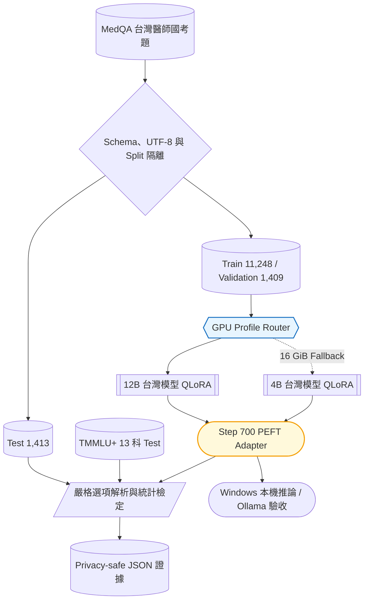
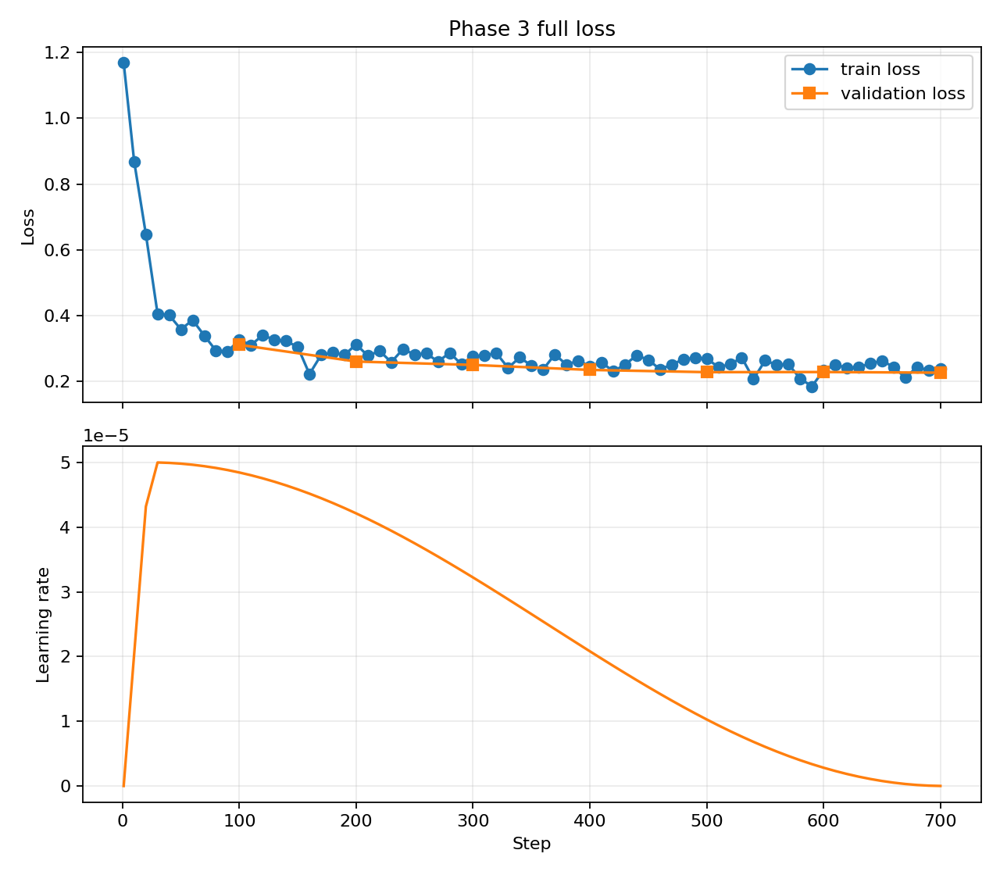

# tw-med-llm-qlora

[](https://github.com/kuotunyu/tw-med-llm-qlora/actions/workflows/ci.yml)
[](https://github.com/kuotunyu/tw-med-llm-qlora/releases/latest)

[](LICENSE)
[](https://huggingface.co/steven0226/tw-med-llm-qlora-adapter)

本專案為臺灣醫療選擇題 (MedQA / TMMLU+) 的 QLoRA 領域微調研究與可重現評估框架。基於 Gemma-3-TAIDE-12B-Chat 進行醫療領域知識適應，最終達成 **MedQA 72.05%** 與 **TMMLU+ 61.53%** 的準確度，並在 28,758 次正式生成實驗中維持 100% 的結構化答案解析率與非醫學控制科目的 Non-inferiority 防護。

> **免責聲明**：本專案僅供研究與教育用途，所有輸出不構成任何臨床診斷、醫療建議或治療依據。

---

## 研究成果

在固定測試集上的橫向對比實驗數據如下：

| 評估集 | 原始 Instruct 模型 | 台灣 Base 模型 | Step 700 Adapter | 相對 Base 模型提升 |
|---|---:|---:|---:|---:|
| **MedQA Test (1,413 題)** | 66.17% | 56.40% | **72.05%** | **+15.64 pp** |
| **TMMLU+ 13 科 (5,573 題)** | 53.47% | 46.80% | **61.53%** | **+14.73 pp** |
| **TMMLU+ 醫學 8 科 Macro** | 52.69% | 45.57% | **60.73%** | **+15.16 pp** |
| **TMMLU+ 控制 5 科 Macro** | 51.73% | 44.91% | **58.41%** | **+13.50 pp** |

- **統計顯著性**：MedQA Adapter 對比 Base 模型，Bootstrap 95% CI 為 **[13.38, 17.98] pp**，McNemar 檢定 **p = 6.11 × 10⁻⁴⁰**。
- **能力退化防護**：5 個非醫學控制科目全數通過預先定義之 **−2 pp Non-inferiority** 門檻。
- **結構解析率**：Adapter 在兩套正式評估集的答案解析率 (Parse Rate) 均達 **100%**。

---

## 系統架構


```mermaid
%%{init: {'themeVariables': {'fontSize': '20px'}}}%%
flowchart TD
    A[("MedQA 台灣醫師國考題")] --> B{"Schema、UTF-8 與 Split 隔離"}
    B --> C[("Train 11,248 / Validation 1,409")]
    B --> D[("Test 1,413")]
    C --> E{{"GPU Profile Router"}}
    E --> F[["12B 台灣模型 QLoRA"]]
    E -. "16 GiB Fallback" .-> G[["4B 台灣模型 QLoRA"]]
    F --> H(["Step 700 PEFT Adapter"])
    G --> H
    D --> I[/"嚴格選項解析與統計檢定"/]
    J[("TMMLU+ 13 科 Test")] --> I
    H --> I
    I --> K[("Privacy-safe JSON 證據")]
    H --> L(["Windows 本機推論 / Ollama 驗收"])

    style E fill:#e7f5ff,stroke:#1971c2,stroke-width:2px
    style H fill:#fff9db,stroke:#f59f00,stroke-width:2px
```

---

## 模型選型與微調配置

| 角色 | 台灣在地模型 | 同尺寸原始基準模型 | 用途說明 |
|---|---|---|---|
| **正式路線** | `taide/Gemma-3-TAIDE-12b-Chat-2602` | `google/gemma-3-12b-it` | QLoRA 微調與正式比較 |
| **16 GiB Fallback** | `twinkle-ai/gemma-3-4B-T1-it` | `google/gemma-3-4b-it` | 低 VRAM 輕量化測試 |

- **超參數配置**：4-bit NF4 量化、LoRA rank/alpha `16/16`、Learning Rate `5e-5`、Max Sequence Length `2048`、Effective Batch Size `16`、Random Seed `3407`、訓練 `1` epoch。
- **Checkpoint 決策**：採用 Step 700；Step 703 因 Validation 出現 NaN 而拒絕採納。

---

## 評估結果（橫向評估與統計檢定）

正式評估固定模型、資料與生成設定，共完成 **28,758 次生成**：

| 模型方案 | MedQA Accuracy / Parse Rate | TMMLU+ Accuracy / Parse Rate |
|---|---:|---:|
| **原始 Instruct 模型** | 66.17% / 99.93% | 53.47% / 99.89% |
| **台灣 Base 模型** | 56.40% / 79.26% | 46.80% / 80.75% |
| **Step 700 Adapter** | **72.05% / 100%** | **61.53% / 100%** |

*註：詳細數據與統計檢定請參閱 [reports/phase4/full/public/phase4-results.json](reports/phase4/full/public/phase4-results.json)。*

---

## 訓練曲線與成本（算力資源）

| 工作步驟 | 硬體設備 | 實際執行用量 |
|---|---|---:|
| **Phase 3 正式 QLoRA** | NVIDIA A100 40GB | 1.143 小時 / **6.06 CU** |
| **Phase 4 正式評估** | NVIDIA A100 40GB | 2.542 小時 / **13.47 CU** |
| **選配 GGUF Q4_K_M 匯出** | NVIDIA A100 40GB | 核准上限 **6.36 CU** |



---

## 快速開始

需求：Windows 11 或 Linux、Python 3.11、`uv`。

### 1. 環境設定與測試

```powershell
git clone https://github.com/kuotunyu/tw-med-llm-qlora.git
cd tw-med-llm-qlora
Copy-Item .env.example .env
uv sync --locked
uv run pytest -q
uv run ruff check .
```

### 2. 資料建置與驗證

```powershell
uv sync --group data --locked
uv run --group data python -m tw_med_qlora.cli.validate_medqa_sample
uv run --group data python -m tw_med_qlora.cli.prepare_medqa
```

### 3. Windows 本地推論

```powershell
uv sync --group inference --locked
uv run tw-med-local-infer `
  --adapter steven0226/tw-med-llm-qlora-adapter `
  --prompt "請選出最適合的答案：..."
```

*註：Adapter 為 Public + Automatic Gated 模式，首次使用請先於 [Hugging Face 模型頁](https://huggingface.co/steven0226/tw-med-llm-qlora-adapter) 完成驗證。*

---

## 模型發布與 Artifacts

[Portfolio closure and license map](https://github.com/kuotunyu/tw-med-llm-qlora/blob/main/docs/portfolio-closure.md) 集中說明公開 artifact、評估證據、授權鏈與安全／重現邊界。

- **GitHub Release**：[`v0.2.0`](https://github.com/kuotunyu/tw-med-llm-qlora/releases/tag/v0.2.0)（包含經 Package Audit 之 Wheel 與 Sdist）。
- **Hugging Face Hub**：[`steven0226/tw-med-llm-qlora-adapter`](https://huggingface.co/steven0226/tw-med-llm-qlora-adapter)（Revision [`b1d8f74`](https://huggingface.co/steven0226/tw-med-llm-qlora-adapter/tree/b1d8f74291da75d0719b5a3ea0d088ee8236e096)）。
- **驗證報告**：包含 [資料驗證](reports/data_validation.json)、[訓練 Manifest](reports/phase3/full/20260722T014216Z-run-manifest.json) 與 [本機推論驗收](reports/phase5/20260722T131736Z-acceptance.json)。

---

## 資料來源與合規聲明

- **MedQA**：[`bigbio/med_qa`](https://huggingface.co/datasets/bigbio/med_qa) (Revision `e04abdc`)。Test Split 嚴格隔離未參與訓練。
- **TMMLU+**：[`ikala/tmmluplus`](https://huggingface.co/datasets/ikala/tmmluplus) (Revision `81d53e3`)。僅用於能力過濾與評估。
- 程式碼採 [MIT License](LICENSE)；Adapter 遵循 TAIDE Gemma 授權與 Gated 使用條款約束，詳見 [模型卡](model_card/README.md) 與 [授權 PDF](model_card/TAIDE-GEMMA-LICENSE.pdf)。

---

## 研究限制

1. **題型範疇**：本研究針對選擇題評估，不直接反映開放式臨床問答能力。
2. **評估環境**：結果對應固定 Revision、Prompt Template 與軟體相依性。
3. **無新訓練過渡**：未在開放文字生成與真實病歷紀錄上發起額外訓練。

---

## 引用方式

格式配置見 [`CITATION.cff`](CITATION.cff)。引用結果請標註 Release Tag `v0.2.0` 與模型 Revision。

---

## 授權

程式碼採 [MIT License](LICENSE)。模型、adapter 與資料仍受各自上游授權與使用條款約束（詳見上方「模型發布與 Artifacts」與「資料來源與合規聲明」）。
